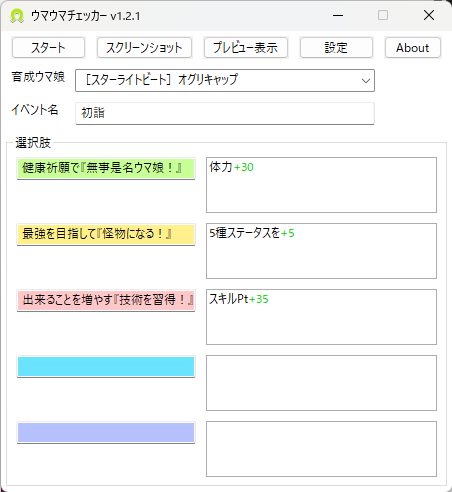
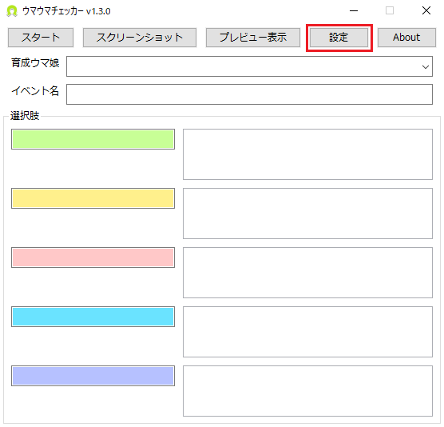
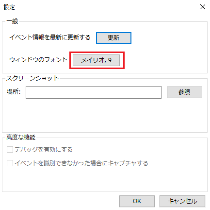

# ウマウマチェッカー(UmaUmaChecker)

## 目的
ウマ娘プリティダービーの育成モードで表示される育成・サポート・シナリオイベントの選択肢から  
実際の数値(例: スピード+10)を見える形で表示します。  

## 動作環境
Windows10/11 64bitで動作を確認しています。

## 注記  
このアプリケーションはウマ娘プリティダービーの育成モードにて動作します。  
画像認識によって各種イベントを識別しています。

## インストール
[こちら](https://github.com/Cilda/UmaUmaChecker/releases) から最新のUmaUmaChecker_vX.X.X.zipをダウンロードします。  
その後、ダウンロードしたzipファイルを解凍して作成されたUmaUmaChecker.exeを実行すると起動します。

## 利用方法
育成を行うウマ娘を「育成ウマ娘」リストから選択します。  
その後「スタート」ボタンを押すと開始され、イベントが表示された際に認識しウマウマチェッカー内の選択肢にステータスが表示されます。

### イベントのアップデート
  新規育成ウマ娘・サポートカードが追加された際は
 「設定」→「一般」欄から「イベント情報を最新に更新する」の右隣にある「更新」ボタンを押してください。  
 　※イベントデータは [GameWith](https://gamewith.jp/uma-musume/)様のサイトよりデータを抽出し生成しています。  

## 詳細設定  
### フォントの変更  
　「設定」→「一般」欄から「ウィンドウのフォント」の横の枠をクリックして変更してください  
   
   

## 不具合＆実装予定(実装されない機能もあります)
- UIの変更
- 一部識別できないイベント修正
 
### 実装済みのアイテム
- URA/アオハル/メイクラ/グラライのシナリオイベント対応  
  →v1.1対応
- 効果欄が見切れた際の表示改善  
 →v1.1対応 
- 選択肢の5択対応  
 →v1.2.1対応

## 使用ライブラリ一覧
- OpenCV
- ~~Microsoft OCR (Microsoft.Media.OCR)~~
- nlohmann-json
- simstring
- Tesseract OCR
- wxWidgets

## 不具合の報告
不具合(イベントが認識しない、バグが発生した等)があれば  
Issuesより報告をお願いします。  
※イベントが認識しない場合等は可能であればスクリーンショットを添付してください。

## 免責事項  
本ソフトウェアを利用によって生じたすべての障害・損害・不具合等に関しては本ソフトウェアの作成者は一切の責任を負いません。  
各自の責任においてご使用ください。  
また、作成者は本ソフトウェアの開発をいつでも停止できるものとします。

## ライセンス
このソースコードはMITライセンスの元ライセンスされています。  
詳しくはLICENSEをご覧ください。  
__注__: このソフトウェアは異なるライセンスのパッケージに依存しています。

## 更新履歴
<pre>
v1.3.0
[Update]
・フォント設定の追加
・ウィンドウのレイアウトを調整
[Fix]
カスタム値が存在しない時にデフォルト値に初期化するように修正

v1.2.3
[Update]
・フォントをYu Gothic UIに変更
・選択肢のテキストボックスを4行表示に変更

v1.2.2
[Update]
・プレビューウィンドウにイベントを識別したらキャプチャ画像を表示
・アプリウィンドウの座標を記憶し再度アプリを起動したら前回と同じ座標に表示する機能を追加
[Fix]
・高DPI時に表示が崩れる現象を修正
・ダイワスカーレットでの育成イベントの不具合を修正

v1.2.1
[Update]
・バージョンチェック追加
・5択表示を追加
[Fix]
・認識精度向上

v1.2
[Update]
・GUIにwxWidgetsを使うように変更
・イベント名識別率の向上
[Add]
・Aboutダイアログ追加
・効果のテキストを色分けするように
・育成ウマのコンボボックスを☆順、ウマ娘順で並び替えるように
・アプリアイコン追加
[Fix]
・ポップアップ表示の修正
・イベント名「お疲れさまです……！」から「お疲れ様です……！」に修正
・キャラ共通イベントで関係のない選択肢名が表示される問題を修正

v1.1
[Update]
・各シナリオイベントを識別できるように追加
・イベント効果説明のエリア表示を調整(カーソルを重ねることで表示が拡張されるように変更)
[Fix]
・識別できないイベントを識別するように修正

beta(v1.0)
新規作成
