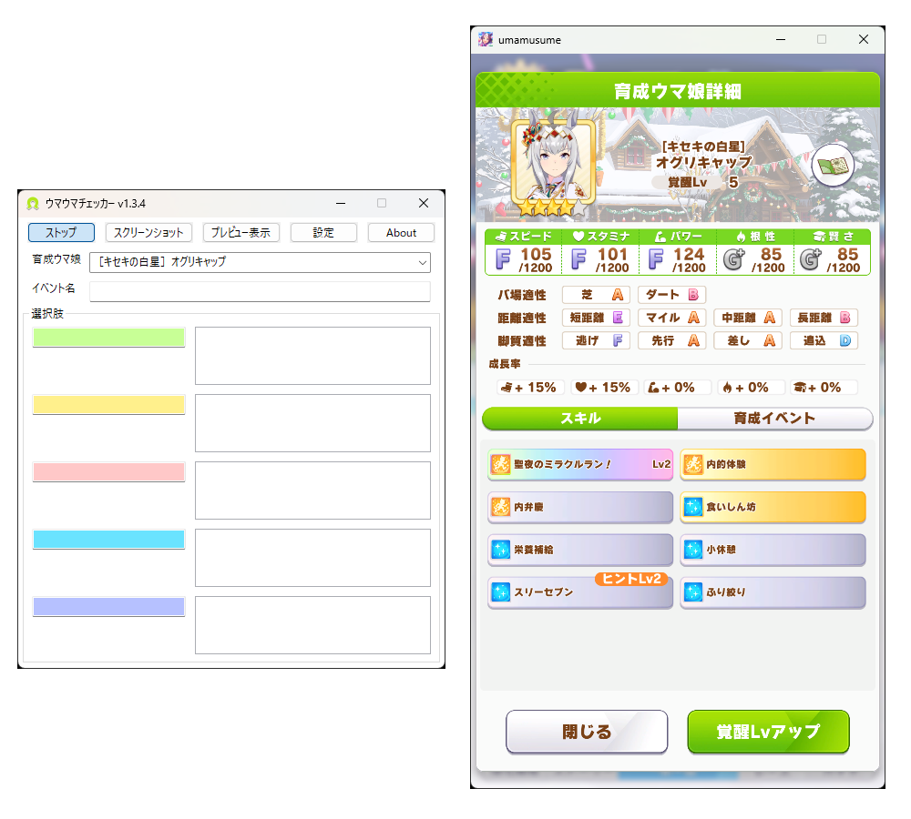
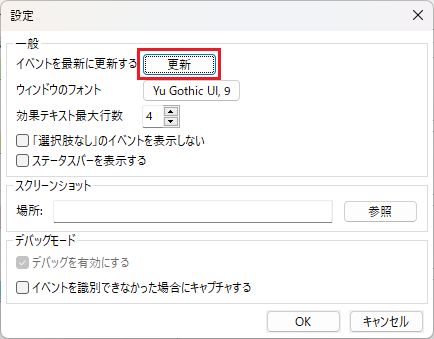
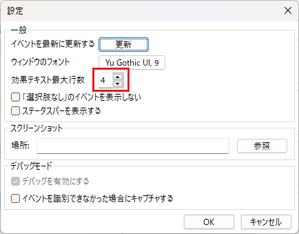

# ウマウマチェッカー

ウマウマチェッカーは、ウマ娘プリティーダービーで画像認識によって選択肢のステータスを表示するツールです。  
Tesseract OCRを使用して画面のスクリーンショットからイベントを認識します。

## 目次
* [ウマウマチェッカー](#ウマウマチェッカー)
  * [機能](#機能)
    * [育成ウマ娘の選択](#育成ウマ娘の選択)
    * [育成ウマ娘の自動選択](#育成ウマ娘の自動選択)
    * [イベントの認識](#イベントの認識)
    * [イベントを最新の状態へ更新](#イベントを最新の状態へ更新)
      * [イベントデータについて](#イベントデータについて)
    * [フォントとサイズを変更](#フォントとサイズを変更)
    * [効果の表示行数](#効果の表示行数)
    * [「選択肢なし」のイベントを表示しない](#「選択肢なし」のイベントを表示しない)
    * [ステータスバーを表示する](#ステータスバーを表示する)
    * [OCR設定](#OCR設定)
      * [OCR数](#OCR数)
      * [キャプチャ方法](#キャプチャ方法)
  * [インストール](#インストール)
  * [実行](#実行)
  * [サポート](#サポート)
  * [ライセンス](#ライセンス)
  * [依存関係](#依存関係)
  * [ビルド](#ビルド)
  * [免責事項](#免責事項)
  * [更新履歴](#更新履歴)

## 機能
ウマウマチェッカーは主に以下の機能を備えています。
 - 育成ウマ娘の自動選択
 - イベント選択肢からステータスを表示

### 育成ウマ娘の選択
育成ウマ娘のコンボボックスから育成対象のウマ娘を選択します。
名前の一部を入力するとオートコンプリート機能により候補を表示することができます。

### 育成ウマ娘の自動選択
  
スタートした状態で育成前・育成中に育成ウマ娘詳細を表示すると認識されます。  
ウマ娘詳細を表示すると自動で選択が行われるため、変更したくない場合はストップ状態にしてください。

### イベントの認識
スタートした状態で育成を行います。  
イベントが表示されると自動で認識が行われ画面にステータスが表示されます。  
サポートカードイベントは育成ウマ娘を選択しなくても認識されますが、育成ウマ娘イベントについては育成ウマ娘を選択しないと認識されません。  
認識されないイベントがある場合は一度 [イベントを最新の状態へ更新](#イベントを最新の状態へ更新) をお試しください。  
※ウマ娘のウィンドウサイズが極端に小さい場合は認識しない場合はあります。

### イベントを最新の状態へ更新
  
「更新」ボタンを押すことでイベントに更新があれば最新に更新されます。  
アップデートにより追加されたウマ娘・サポートカードのイベントが認識されない場合は
更新することで認識されるようになります。  

#### イベントデータについて  
   ・イベントデータは [GameWith](https://gamewith.jp/uma-musume/)様のサイトよりデータを抽出し生成しています。   
   ・イベントデータは毎日 __9時__、__15時__、__18時__、__22時__ に更新しています。  
   　※サーバの状態によっては更新が遅れることがあります  
   ・新しいカードが発表された当日はまだデータが揃ってない可能性があります。  

### フォントとサイズを変更
デフォルトのフォントが見づらい等の場合に変更します。  
4Kディスプレイを用いて育成する場合など、ウィンドウサイズが小さい時に変更することで表示が見やすくなります。  
現在はフォントとフォントサイズの変更に対応しています。  
デフォルトではYu Gothic UIが選択されています。

### 効果の表示行数
  
表示行数を変更することで以下のようにイベントの効果が表示されるテキストボックスの行数が調整できます。  
(4行から6行に変更した場合)  

  

### 「選択肢なし」のイベントを表示しない
選択肢がないイベントの場合、チェックを入れることでイベントが表示されなくなります。  
選択肢のタイトルが「選択肢なし」と付くイベントが含まれる場合のみのため、一部のイベントは表示される可能性があります。

### ステータスバーを表示する
ステータスバーを表示します。  
ステータスバーには1秒毎にアプリケーションのCPUとメモリの使用率が表示されます。

### OCR設定
OCRを行う際の設定です。

#### OCR数
起動時に予めOCR数の設定値分だけTesseractのインスタンスを生成します。  
1インスタンスあたり20MB程度メモリを消費します。  
生成されたインスタンスはすべて使われるわけではなく、  
イベントを1度識別するごとに3～4つ程度のスレッドでインスタンスを使用します。  

#### キャプチャ方法
イベントの識別やスクリーンショット撮影時のキャプチャ方法を選択します。  
- BitBlt   
全ての環境で動作します。   
ウマ娘のウィンドウに他のウィンドウが重なっている場合、  
スクリーンショットに重なっているウィンドウが映り込みます。

- Windows 10 (1903以降)  
Windows Graphics Captureの機能を使いウマ娘のウィンドウを撮影します。  
他のウィンドウがウマ娘のウィンドウに重なっていてもウマ娘のみをキャプチャできます。  
Windows 10の1903以降で利用可能です。  
利用できない場合は設定に選択肢が表示されません。

## インストール
[リリースページ](https://github.com/Cilda/UmaUmaChecker/releases)から最新バージョンのUmaUmaChecker_vX.X.X_x64.zipをダウンロードします。  

## 実行
ZIPファイルを展開してできたフォルダ内のUmaUmaChecker.exeを実行します。

## サポート
不具合・機能の要望は[Issues](https://github.com/Cilda/UmaUmaChecker/issues)からIssueを作成してください。  
また、イベントが認識しない場合はツールのスクリーンショットで撮影された画像を添付してください。

## ライセンス
このソースコードはMITライセンスの元ライセンスされています。  
詳しくはLICENSEをご覧ください。  
__注__: このソフトウェアは異なるライセンスのパッケージに依存しています。

## 依存関係
このソースコードは以下のオープンソースソフトウェアを利用しています。
- OpenCV
- nlohmann-json
- simstring
- Tesseract OCR
- wxWidgets
- Boost.Log
- Boost.Locale

またライブラリ管理に __vcpkg__ を利用しています。

## ビルド
前提条件:  
- Visual Studio 2019以降
- vcpkg
  
vcpkgのインストールについては、https://github.com/microsoft/vcpkg をご覧ください。  
Visual Studioでvcpkgを利用するために以下を実行してください。
<pre>
> vcpkg integrate install
</pre>

プロジェクトをビルドするために以下でリポジトリをクローンするか、ダウンロードします。
<pre>
> git clone https://github.com/Cilda/UmaUmaChecker
</pre>

UmaUmaChecker.slnを開いてビルドを行います。  
必要なライブラリはvcpkgがダウンロードするので操作は必要ありません。  
ライブラリのビルドを行うため、環境によってはビルド時間が長くなることがあります。

## 免責事項  
本ソフトウェアを利用によって生じたすべての障害・損害・不具合等に関しては本ソフトウェアの作成者は一切の責任を負いません。  
各自の責任においてご使用ください。  
また、作成者は本ソフトウェアの開発をいつでも停止できるものとします。

## 更新履歴
<pre>
v1.4.3
[Update]
・イベント識別のngramを3から2に変更
・シナリオイベントの読み込み処理を修正
・識別精度向上
[Fix]
・終了時に例外が発生していた問題を修正
・イベント選択肢を識別する際のしきい値を追加
・テーマクラスのメモリリークを修正

v1.4.2
[Update]
・育成ウマ娘自動認識の精度を向上

v1.4.1
[Update]
・デバッグの設定を変更
・スタートと停止の動作を高速化
[Fix]
・キャプチャ方式「Windows 10(1903以降)」でキャプチャする際、ウマ娘を終了して再度起動するとウマウマチェッカーが強制終了していた問題を修正
・育成ウマ娘の共通イベントの選択肢名がすべて読み込まれていなかった問題を修正

v1.4.0
[Add]
・テーマを実装
・キャプチャ方式を追加
・起動時にイベントデータを自動更新
・スクリーンショットボタンを右クリックすると保存先を開く
・ログを保存するように
[Update]
・設定のフォントをコンボボックスに変更
[Fix]
・識別率修正
・更新確認ボタンで開くダイアログが閉じられたときにフォーカスが別ウィンドウに移動する問題を修正

v1.3.6
[Fix]
・ナリタブライアンの育成イベント「憧憬」が識別できない問題を修正

v1.3.5
[Add]
・OCRの速度に関する設定を追加
・スクリーンショットの画像タイプを設定できるように(PNG、JPEGを選択可能)
・起動時に更新がある場合に通知を行うように
・起動時の更新通知の設定を追加
・イベント情報更新の対象に「ScenarioEvents.json、Skills.json、ReplaceText.json」を追加
・イベントで取得できるスキルの効果を表示するように
[Update]
・シナリオイベントのタイトルからイベントを識別できない場合に選択肢からイベントを識別するように
・Aboutダイアログに使用ライブラリを記載

v1.3.4
[Add]
・育成ウマ娘のオートコンプリート追加
[Update]
・プレビューに保存されている画像を保存できるように
・効果の表示行数を変更可能
・オプションに表示行数の設定を追加
・イベント更新時に更新が不要な場合は「更新はありません」と出るように
[Fix]
・サポートカードイベントの選択肢名から識別できない問題を修正

v1.3.3
[Add]
・ステータスバーを追加(メモリ使用率、CPU使用率を表示)
・イベントを自動キャプチャする機能を追加
[Update]
・イベント識別アルゴリズムを改良  
[Fix]
・メモリリーク問題を修正

v1.3.2
[Update]
・イベント識別アルゴリズムを改良  
[Fix]
・メモリ使用量(メモリリーク)の改善  

v1.3.1
[Update]
・分岐のない選択肢を非表示にする設定の追加
・育成ウマ娘の自動認識  
　※育成開始画面を「スタート」押した状態で認識させないと機能しません  
[Fix]
・メモリ使用量の改善  
・イベント認識精度改善  

v1.3.0
[Update]
・フォント設定の追加
・ウィンドウのレイアウトを調整
[Fix]
・カスタム値が存在しない時にデフォルト値に初期化するように修正

v1.2.3
[Update]
・フォントをYu Gothic UIに変更
・選択肢のテキストボックスを4行表示に変更

v1.2.2
[Update]
・プレビューウィンドウにイベントを識別したらキャプチャ画像を表示
・アプリウィンドウの座標を記憶し再度アプリを起動したら前回と同じ座標に表示する機能を追加
[Fix]
・高DPI時に表示が崩れる現象を修正
・ダイワスカーレットでの育成イベントの不具合を修正

v1.2.1
[Update]
・バージョンチェック追加
・5択表示を追加
[Fix]
・認識精度向上

v1.2
[Update]
・GUIにwxWidgetsを使うように変更
・イベント名識別率の向上
[Add]
・Aboutダイアログ追加
・効果のテキストを色分けするように
・育成ウマのコンボボックスを☆順、ウマ娘順で並び替えるように
・アプリアイコン追加
[Fix]
・ポップアップ表示の修正
・イベント名「お疲れさまです……！」から「お疲れ様です……！」に修正
・キャラ共通イベントで関係のない選択肢名が表示される問題を修正

v1.1
[Update]
・各シナリオイベントを識別できるように追加
・イベント効果説明のエリア表示を調整(カーソルを重ねることで表示が拡張されるように変更)
[Fix]
・識別できないイベントを識別するように修正

beta(v1.0)
新規作成
</pre>
