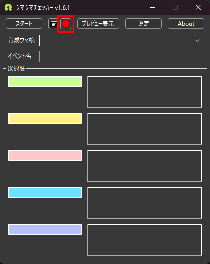

# レシート因子撮影

## 使い方
ウマ娘のスキルや因子をレシート因子として撮影します。

  
まずは、ウマ娘詳細の**スキル**または**因子**タブを開きます。  
赤枠のボタンを押して撮影を開始します。  
撮影中はボタンが赤色の四角へと変わります。
その後、ゆっくりとスクロールを行います。  
一番下までスクロールすると撮影が自動で停止され、スクリーンショット保存先に *combine_YYYY-MM-DD_HH-mm-ss* のファイル名で保存されます。  
途中で撮影を完了したい場合は赤枠のボタンを押して停止してください。
停止ボタンを押した際の画面を最後の画像として画像を生成します。

## 各種ボタンの動作
各ボタンの意味は以下の通りです。  
|ボタンの種類|意味|  
|:---:|:---|  
||停止状態です、押すとキャプチャを開始します。|
||スクロールバーが最上部にない状態でキャプチャが開始されました。最上部までスクロールすると撮影がスタートします。|
||キャプチャ中です。手動で結合を停止する場合に押してください。|