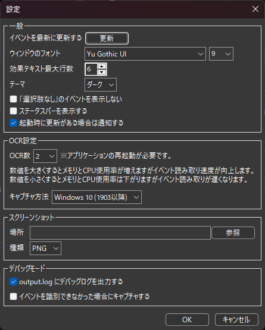
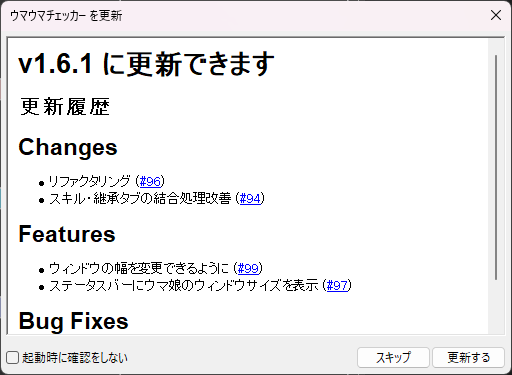

# 設定画面

  

## 目次
- [一般](#一般)
    - [イベントを更新する](#イベントを更新する)
    - [ウィンドウのフォント](#ウィンドウのフォント)
    - [効果テキスト最大行数](#効果テキスト最大行数)
    - [テーマ](#テーマ)
    - [「選択肢なし」のイベントを表示しない](#「選択肢なし」のイベントを表示しない)
    - [ステータスバーを表示する](#ステータスバーを表示する)
    - [起動時に更新がある場合は通知する](#起動時に更新がある場合は通知する)
- [OCR設定](#OCR設定)
    - [OCR数](#OCR数)
    - [キャプチャ方式](#キャプチャ方式)
- [スクリーンショット](#スクリーンショット)
    - [場所](#場所)
    - [種類](#種類)
- [デバッグモード](#デバッグモード)
    - [output.logにデバッグログを出力する](#output.logにデバッグログを出力する)
    - [イベントを識別できなかった場合にキャプチャする](#イベントを識別できなかった場合にキャプチャする)

## 一般

### イベントを更新する
サポートカード、育成ウマ娘、シナリオイベントのデータを更新します。  

### ウィンドウのフォント
フォントやフォントサイズを変更できます。  
高DPIや大きいディスプレイを使用していてウィンドウが見づらい場合にフォントサイズ等を変えると見やすくなります。

### 効果テキスト最大行数
表示されているイベントの選択肢を表示するテキストボックスの最大行数を変更します。  
デフォルトは4が設定されています。

### 「選択肢なし」のイベントを表示しない
イベントの選択肢が「選択肢なし」となっているイベントは表示しません。  
選択肢が存在しないイベントが表示されるのが煩わしい場合に有効にします。

### ステータスバーを表示する
ステータスバーを表示します。  
CPU、メモリの使用率やウマ娘のウィンドウサイズが表示されます。

### 起動時に更新がある場合は通知する
起動時に更新があるかチェックを行い、更新がある場合には以下の通知が表示されます。  
  
**スキップ**を押すとダイアログが閉じます。  
**更新する**を押すとダウンロードページが開きます。

## OCR設定

### OCR数
数値を大きくするほど識別が速くなりますが、メモリ使用量も多くなります。  
1～10までの数値で選択できます。

### キャプチャ方式
**BitBlt**は従来のキャプチャ方式です。  
キャプチャする際に他のウィンドウが重なっていると一緒に撮影されてしまいます。  
**Windows10 (1903以降)**は比較的新しいキャプチャ方式です。  
ウィンドウが最小化されていてもキャプチャができ、高速です。

## スクリーンショット

### 場所
スクリーンショットの保存先です。  
空の場合は実行ファイルと同じディレクトリのscreenshotsフォルダに保存されます。

### 種類
保存する画像のタイプです。  
現在はPNG、JPEGをサポートしています。

## デバッグモード

### output.logにデバッグログを出力する
output.logファイルにデバッグログを出力します。

### イベントを識別できなかった場合にキャプチャする
認識できなかった場合に画像をスクリーンショット保存先へ自動で保存します。